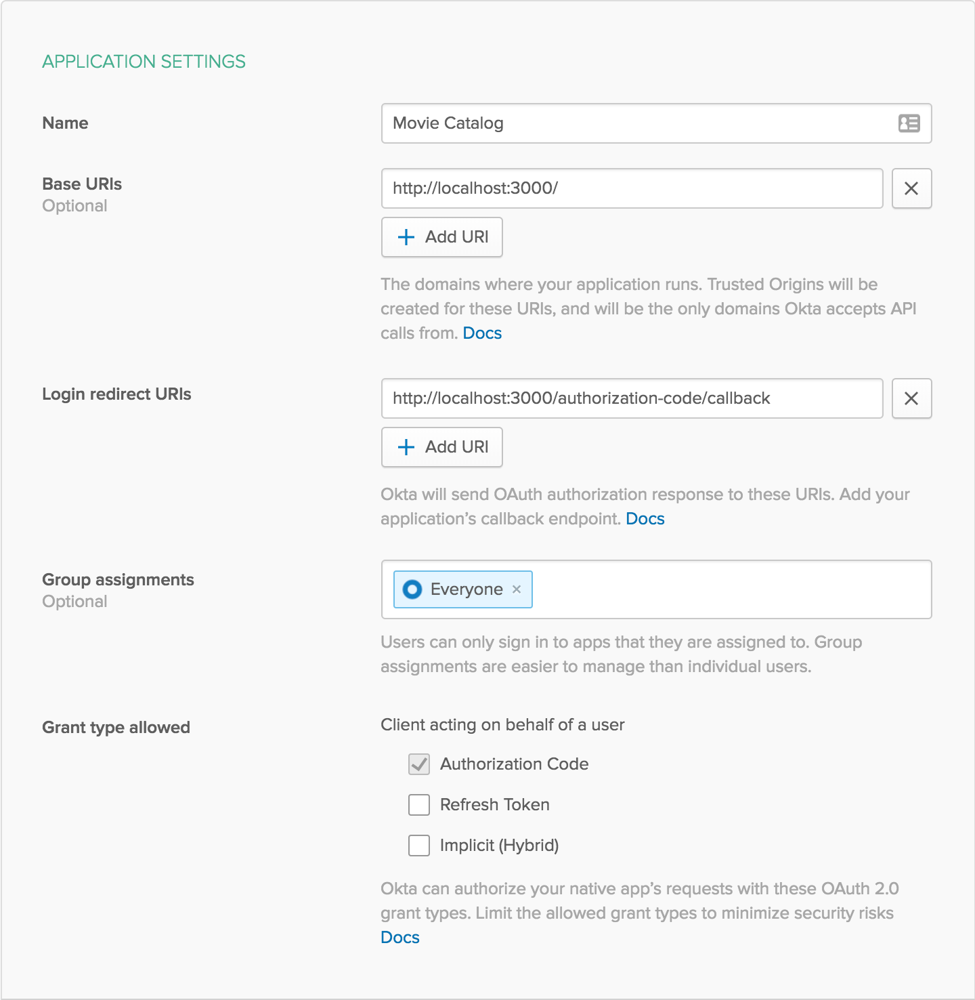

REST API with Node and Postgres

This is an example of a simple REST API with secure user authentication 
using Express, PostgreSQL, and Okta. 
This API allows users to keep track of their own library of movies and TV shows across multiple services. 


To integrate Okta's Identity Platform for user authentication, you'll first need to:


* Sign up for a free Okta Developer account](https://www.okta.com/developer/signup/)

* You will get a URL similar to `https://dev-123456.oktapreview.com`.
  
* Save this URL for later
  
* You will also use this URL to login to your Okta account

You will need to create an application in Okta:


* Log in to your Okta account, then navigate to 
**Applications** and click the **Add Application** button
* Select **Web** and click **Next**
* 
Give your application a name (e.g. "Movie Catalog")

* Change the **Base URI** to `http://localhost:3000/` and the 
**Login redirect URI
** to `http://localhost:3000/authorization-code/callback`, then click 
**Done**
* 
Save your **Client ID** and **Client Secret** for later


Your Okta application should have settings similar to the following:





You will also need to sign up for an API token with [The Open Movie Database](https://www.omdbapi.com/apikey.aspx).


Now create a file called `.env` in the project root and add the following variables, replacing the values with your own 
from the previous steps.


**.env**
```bash
OMDB_API_KEY={yourOMDbAPIKey}

OKTA_ORG_URL=https://{yourOktaOrgUrl}

OKTA_CLIENT_ID={yourClientId}

OKTA_CLIENT_SECRET={yourClientSecret}
```


You also need an app secret. 

One way to get a random `APP_SECRET` is to use the following commands, which will generate a random value and add it to 
your `.env` file.

```bash
npm install -g uuid-cli
echo "APP_SECRET=`uuid`" >> 

.env
```

Now you can run the web server with the following command:


```bash
npm start
```


## Links

This example uses the [Okta Node SDK](https://github.com/okta/okta-sdk-nodejs) 
and the [Okta OIDC Middleware](https://github.com/okta/okta-oidc-js/tree/master/packages/oidc-middleware).


## Help

Please [raise an issue](https://github.com/oktadeveloper/okta-node-postgres-example/issues) if you find a 

problem with the example application, or visit our [Okta Developer Forums](https://devforum.okta.com/). 


